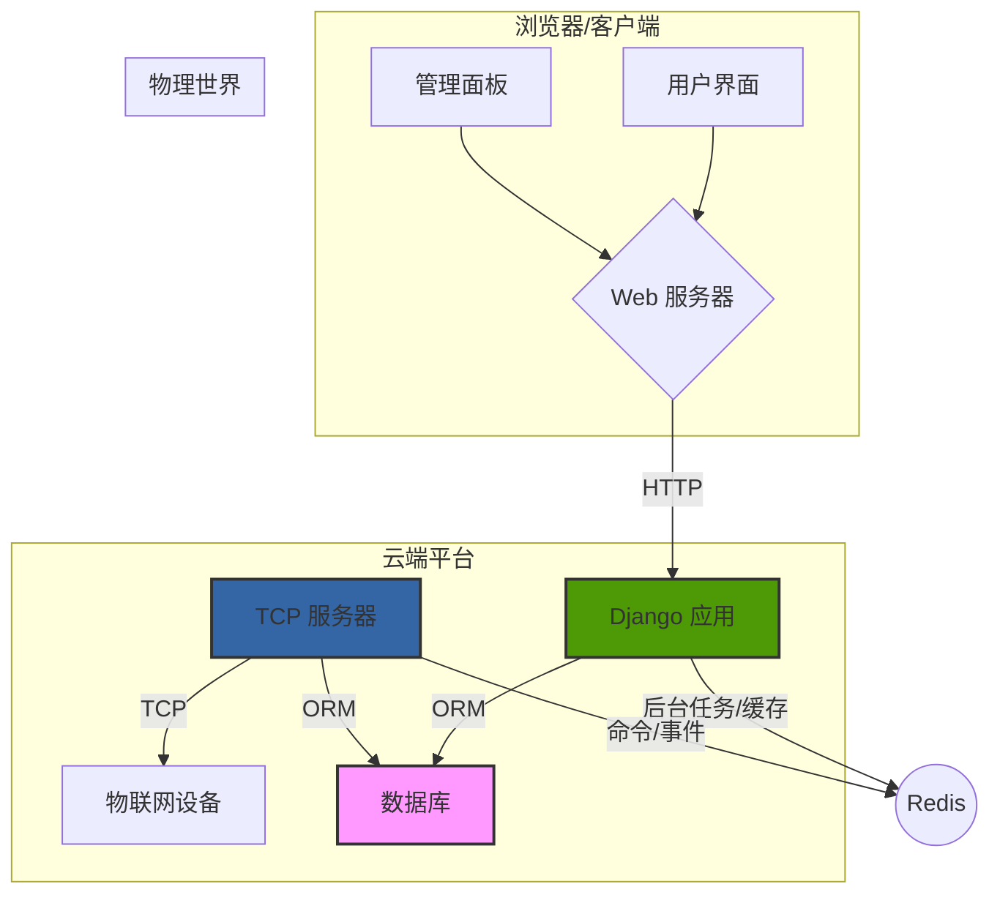

# NovaCloud - 一体化物联网云平台

<p align="center">
  
</p>

<p align="center">
  <strong>一个功能强大、可扩展的开源物联网云平台，旨在简化设备连接、数据管理和自动化策略。</strong>
</p>

<p align="center">
    <a href="/LICENSE"></a>
    <a href="#"></a>
    <a href="#"></a>
</p>

---

## 📖 项目简介

NovaCloud 是一个综合性的物联网解决方案，集成了设备管理、数据采集、实时通信、自动化策略引擎和用户权限管理等功能。它后端完全基于强大的 Django 框架构建，前端界面美观、响应式，并支持明暗主题切换，旨在为开发者和最终用户提供卓越的使用体验。

## ✨ 核心功能

- **用户与权限管理 (RBAC)**:
    - 完善的用户注册、登录、个人资料管理。
    - 基于角色的访问控制，支持自定义角色和权限分配。
    - 系统内置"超级管理员"和"普通用户"角色，并可自动分配。
    - 支持管理员创建、管理自定义角色。
    - 用户邀请码系统。

- **自定义管理面板**:
    - 提供一个比 Django Admin 更现代、更集成的管理后台。
    - 可视化用户层级树，支持拖拽修改组织架构。
    - 统一的用户和角色管理界面。

- **物联网实体管理**:
    - **项目 (Project)**: 对设备和策略进行逻辑分组。
    - **设备 (Device)**: 完整的设备生命周期管理 (CRUD)，自动生成设备ID和密钥。
    - **传感器 (Sensor) & 执行器 (Actuator)**: 在设备下定义数据采集点和控制点。

- **实时设备通信**:
    - 基于 `asyncio` 的高并发 TCP 服务器，用于设备连接和数据交换。
    - 安全的设备认证机制。
    - 标准化的 JSON 数据帧格式，支持数据上报、心跳和命令下发。
    - 详细的 `TCP通信指南.md` 和测试工具。

- **自动化策略引擎**:
    - 强大的规则引擎，实现物联网场景的自动化。
    - 支持多种触发器：传感器数据、定时任务、设备状态变化。
    - 灵活的条件组（与/或逻辑）和多步动作流。
    - 可视化的策略配置界面。
    - 详细的策略执行日志。

- **现代化前端**:
    - 遵循统一的 UI 设计规范，界面美观易用。
    - 完全响应式设计，适配不同尺寸的设备。
    - 支持用户选择的明暗主题，并能记忆用户偏好。
    - 大量使用 AJAX 提升交互体验。

## 🏗️ 系统架构

NovaCloud 采用经典的后端架构，以充分利用 Django 框架的优势：

- **Django**: 负责处理项目的所有核心逻辑，包括 Web 请求、API 接口、数据模型 (ORM)、数据库迁移、用户认证、会话管理、模板渲染以及强大的后台管理系统 (Django Admin 和自定义的 `admin_panel`)。
- **TCP 服务器**: 一个独立的 `asyncio` TCP 服务，负责处理设备长连接、认证和实时数据交换。它能加载 Django 环境以直接与数据库模型交互。
- **数据库**: 开发环境使用 SQLite，生产环境推荐使用 PostgreSQL。
- **前端**: 使用原生 HTML/CSS/JavaScript，无大型前端框架依赖，轻量且高效。



## 🛠️ 技术栈

- **后端**: Python, Django
- **数据库**: SQLite, PostgreSQL
- **实时通信**: `asyncio`
- **前端**: HTML5, CSS3, JavaScript (ES6+)
- **UI/UX**: Font Awesome

## �� 快速开始

### 1. 环境准备

- Python (推荐 3.9 或更高版本)
- Git

### 2. 安装与配置

1.  **克隆代码库**:
    ```bash
    git clone https://github.com/your-username/NovaCloud.git
    cd NovaCloud
    ```

2.  **创建并激活虚拟环境**:
    ```bash
    # Windows
    python -m venv venv
    .\venv\Scripts\activate
    
    # macOS / Linux
    python3 -m venv venv
    source venv/bin/activate
    ```

3.  **安装依赖**:
    项目尚未提供 `requirements.txt`，您可以手动安装主要依赖：
    ```bash
    pip install Django python-dotenv djangorestframework
    # 根据需要安装其他库
    ```
    *建议您在完成安装后，使用 `pip freeze > requirements.txt` 生成依赖文件。*

4.  **配置环境变量**:
    在项目根目录下创建一个名为 `.env` 的文件，并填入以下内容：
    ```env
    # Django
    SECRET_KEY='your-strong-secret-key'  # 请生成一个强密码
    DEBUG=True
    
    # 数据库 (开发环境使用默认的 SQLite)
    # DATABASE_URL=
    
    # TCP 服务器
    TCP_SERVER_HOST=0.0.0.0
    TCP_SERVER_PORT=8888
    ```
    您可以使用 `python -c 'from django.core.management.utils import get_random_secret_key; print(get_random_secret_key())'` 来生成一个安全的 `SECRET_KEY`。

### 3. 数据库初始化

1.  **执行数据库迁移**:
    ```bash
    python manage.py makemigrations
    python manage.py migrate
    ```

2.  **创建系统默认角色**:
    此命令会创建 "超级管理员" 和 "普通用户" 两个关键角色。
    ```bash
    python manage.py create_default_roles
    ```

### 4. 创建第一个管理员用户

项目设计了两种方式创建管理员：

- **方式一 (推荐)**: 访问注册页面，**第一个成功注册的用户**将自动被授予"超级管理员"角色和员工权限 (`is_staff=True`)。
- **方式二 (传统方式)**:
    ```bash
    python manage.py createsuperuser
    ```

## 🖥️ 如何使用

### 1. 运行 Web 服务器

```bash
python manage.py runserver
```
现在您可以通过浏览器访问 `http://127.0.0.1:8000` 来查看网站、注册和登录。

### 2. 运行 TCP 服务器

打开**新的**终端窗口，并确保虚拟环境已激活。
```bash
python manage.py run_tcp_server --host 0.0.0.0 --port 8888
```
服务器将开始监听设备连接。

### 3. 模拟设备连接

项目提供了强大的测试工具来模拟设备。

1.  **创建测试设备**: 首先，在网站上登录您的管理员账户，进入"项目管理"，创建一个项目。然后进入项目，创建一个设备。记下生成的设备ID和设备密钥。

2.  **使用测试客户端**:
    项目提供了一个 `test_client.py` 脚本用于模拟设备行为。您可以使用它来连接、认证、发送数据和心跳。
    ```bash
    # 示例用法 (请根据实际情况修改设备ID和密钥)
    python test_client.py --device-id "your-device-id" --device-key "your-device-key"
    ```
    更详细的用法请参考 `docs/NovaCloud通信工具使用指南.md`。

## 📂 项目结构

```
NovaCloud/
├── accounts/             # 用户认证、权限、邀请码
├── admin_panel/          # 自定义管理面板
├── communication_handler/  # TCP 服务器逻辑
├── core/                 # 项目核心功能、首页、审计日志
├── iot_devices/          # 物联网实体 (项目, 设备, 传感器, 执行器)
├── strategy_engine/      # 自动化策略引擎
├── NovaCloud/            # Django 项目主配置
├── static/               # 全局静态文件 (CSS, JS, Fonts)
├── templates/            # 全局 HTML 模板
├── docs/                 # 项目详细文档
├── manage.py             # Django 管理脚本
└── README.md             # 你正在阅读的文件
```

## 🗺️ 未来路线图

- [ ] **数据可视化**: 使用 Chart.js 在前端展示传感器历史数据图表。
- [ ] **后台任务**: 集成 Celery 用于处理耗时任务，如发送通知、执行复杂策略。
- [ ] **MQTT 支持**: 添加 MQTT 协议作为设备连接的备选方案。
- [ ] **端到端测试**: 编写更完善的单元测试和端到端测试。

## 🤝 贡献指南

我们欢迎所有形式的贡献！如果您想为 NovaCloud 做出贡献，请遵循以下步骤：

1.  Fork 本仓库。
2.  创建您的特性分支 (`git checkout -b feature/AmazingFeature`)。
3.  提交您的更改 (`git commit -m 'Add some AmazingFeature'`)。
4.  将分支推送到您的 Fork (`git push origin feature/AmazingFeature`)。
5.  提交一个 Pull Request。

## 📄 许可证

本项目基于 [MIT License](/LICENSE) 开源。

---

<p align="center">
  由 NovaCloud 团队用心构建 ❤️
</p> 